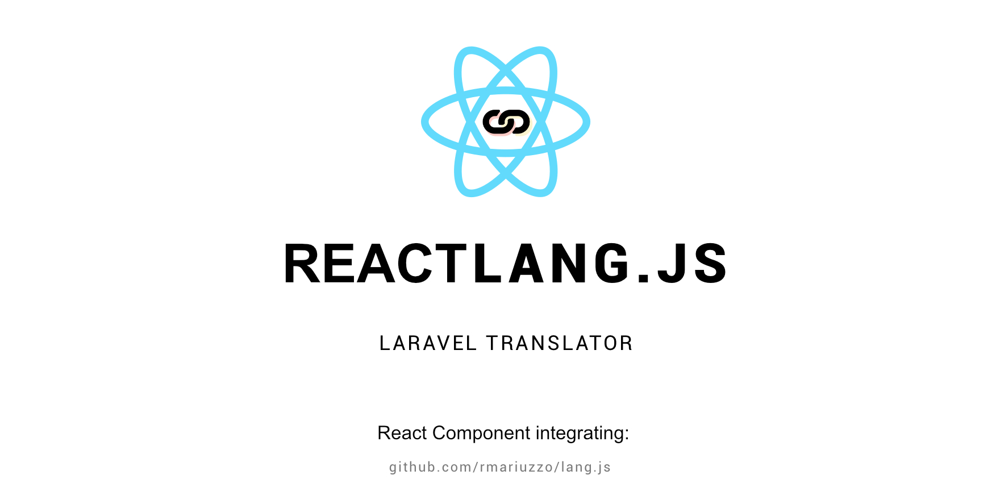

[](https://travis-ci.org/amogower/reactlang.js)
[](https://badge.fury.io/js/reactlang.js)
[](https://codecov.io/gh/amogower/reactlang.js)


[](https://raw.githubusercontent.com/amogower/reactlang.js/master/LICENSE)

## Installation

Different installation methods:

 - Yarn: `yarn add reactlang.js`
 - NPM: `npm install reactlang.js`
 - Manually: [Download latest release](https://github.com/amogower/reactlang.js/releases/latest)

## Documentation

### How to Use

```js
const lang = {
    common: {
        hello_world: 'Hello, world!'
    }
};

<Translatable
    lang={lang}
    content={{
        transKey: 'common.hello_world'
    }}
/>
```

Will render the following:

```html
<span>Hello, world!</span>
```

#### With children

```js
const lang = {
    common: {
        first_name: 'First name'
    }
};

<Translatable
    lang={lang}
    attributes={{
        placeholder: {
            transKey: 'common.first_name'
        }
    }}
>
    <input type="text" />
</Translatable>
```

Will render the following:

```html
<input type="text" placeholder="First name" />
```

### Messages source format

The messages source format should look like the following:

```js
{
    name: {
        key1: 'value1',
        key2: 'value2',
        // ... and more key-value pairs.
    },
    name: {
        key1: 'value1',
        key2: 'value2',
        // ... and more key-value pairs.
    },
    // ... and more locales.
}
```

### Properties

The component MUST receive the `lang` property AND either a `content` property OR an `attributes` property.

#### `lang` (Required)

An object matching the Messages source format like below:

```js
{
    common: {
        home: 'Home',
        about: 'About',
        contact: 'Contact'
    },
    search: {
        filter: 'Filter',
        price_range: 'Price Range'
    }
}
```

#### `content` (Optional)

An object containing any of the following properties (transKey is required):

```js
{
    transKey: 'common.people_lower',
    count: 5,
    replacements: {
        number: 5
    }
}
```

#### `attributes` (Optional)

An object with element attributes as keys with object values containing the same properties as the `content` property (transKey is required):

```js
{
    placeholder: {
        transKey: 'common.select'
    }
}
```

#### `id` (Optional)

An id to be applied to the span rendered by the component when no children are present.

#### `className` (Optional)

A class name string.

#### `handleError` (Optional)

A function for handling errors.  Receives an object like the following:

```js
{
    message: 'The Translatable component only allows a single child',
    name: 'Too many children'
}
```

## Development

 1. Fork this repository and clone it.
 2. Create a branch from develop: `git checkout -b feature/xxxxxxx`
 3. Submit a PR to be merged into develop branch.

## Testing

To run the tests use the following commands:

 - Single run: `npm run test`
 - Run on changes: `npm run test:watch`

 ## License

[](https://app.fossa.io/projects/git%2Bgithub.com%2Famogower%2Freactlang.js?ref=badge_large)
